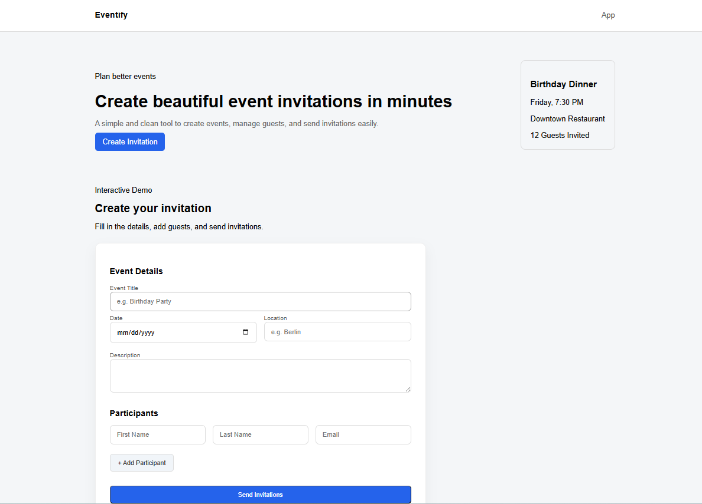

# 🎉 Eventify – Event Invitation App

A modern, responsive frontend application for creating and managing event invitations, built with **vanilla JavaScript**.

This project has been refactored from a basic practice app into a **product-style landing page + interactive form**, with a strong focus on clean UI, user experience, and maintainable code.

---

##  Preview

<p align="center">
  
</p>

---

## ✨ Features

###  Event Management

* Create event details (title, date, location, description)
* Real-time validation for user inputs
* Inline error messages (no disruptive alerts)

###  Participants Handling

* Add and remove participants dynamically
* Email validation with immediate feedback
* Structured and readable participant list

###  UX Improvements

* Structured form sections (Event Details / Participants)
* Inline validation with visual feedback (error / success states)
* Non-blocking UI error system (no alert popups)
* Disabled button and loading state during submission

###  UI & Design

* Landing page layout (Hero section + App section)
* Clean and modern design with proper spacing and hierarchy
* Responsive layout for different screen sizes

---

##  Technologies

* HTML5
* CSS3 (custom styling, no frameworks)
* Vanilla JavaScript (DOM manipulation, state handling)

---

##  Key Focus

This project focuses on:

* Writing clean, readable frontend code
* Improving UX with real-time feedback
* Structuring UI like a real-world product
* Avoiding anti-patterns (e.g., alert-based validation)
* Managing UI state without frameworks

---

##  Getting Started

1. Clone the repository:

```bash
git clone https://github.com/nasim-molana/event-invitation-app.git
```

2. Open the project:

```bash
cd event-invitation-app
```

3. Run the app:

* Open `index.html` in your browser
  or
* Use **Live Server** in VSCode

---

##  Next Steps

* Add live event preview (dynamic UI updates)
* Improve accessibility (ARIA, keyboard navigation)
* Add micro-interactions and animations
* Optional: integrate backend for real email sending

---

##  Notes

* Email sending is simulated (no backend)
* This is a frontend-focused project designed for portfolio purposes

---

## 👤 Author

Nasim Molana
Frontend Developer
